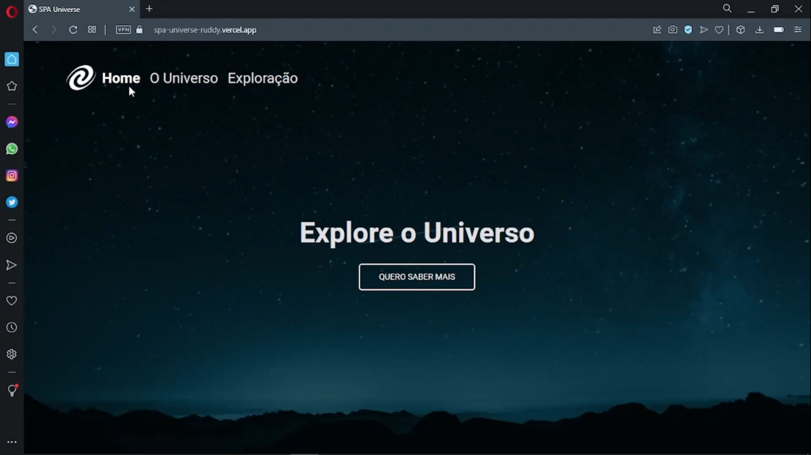

# SPA Universe

<h1 align="center">
    
</h1>

<br>

### 💻 SPA Universe

O desafio é construír uma página com conceitos de SPA(Single Page Application) Aplicação de Página Única, são aplicações cuja funcionalidade está concentrada em uma única página. Ao invés de recarregar toda a página ou redirecionar o usuário para uma página nova, apenas o conteúdo principal é atualizado de forma assíncrona, mantendo toda a estrutura da página estática. são aplicações cuja funcionalidade está concentrada em uma única página. Ao invés de recarregar toda a página ou redirecionar o usuário para uma página nova, apenas o conteúdo principal é atualizado de forma assíncrona, mantendo toda a estrutura da página estática.
Trabalhar com eventos javascript, assincronismo, promises, conceitos de POO(Programção Orientada a Objetos) com classes, utilizar layout do figma como base para estilo da página.

Acesse a página do projeto: [Clique Aqui](https://spa-universe-ruddy.vercel.app/)

O que foi feito:

- Lógica e Algoritmos com Javascript;
- Conceitos de SPA;
- Mapeamento de rotas;
- Assíncrono e promises;
- Orientação a objetos;
- Classes e eventos;
- Layout do Figma;
- Versão mobile e responsividade com CSS Flex;
- Tipos de dados no javascipt;
- Manipular a DOM;
- Funções callbacks;
- Clean Code;
- ES6 Modules;
- Injeção de dependências;
- Estruturando HTML com tags semânticas;
- Unidade de medida flexível;
- Breakpoints com media query;
- Importar arquivo de CSS externo no projeto;
- Aplicando fontes(tipografia) customizadas no arquivo do CSS e iniciar o CSS externo;
- Trabalhando com cores e fontes;
- Alinhando e posicionando textos e elementos;
- Aplicando os espaçamentos;
- Bordas e classificações de elementos;
- Transições em CSS;
- Utilizar variaveis CSS para manipular a paleta de cores do projeto e tamanho da fonte;
- Reset CSS removendo possíveis inconsistências entre navegadores diferentes;
- Estrutura de sistema de arquivos do projeto separado por pasta;


Aplicado meu conhecimento do Explorer da Rocketseat conceitos de forma prática 
nesse projeto, com as aulas:

- Conhecendo novos conceitos de HTML e CSS;
- Avançando no HTML e CSS;
- Responsividade;
- Avançando na Programação WEB com Javacript;
- Javascript antes do framework;
- Conceitos de SPA;
  
<br />

- [EXPLORER - Rocketseat](https://www.rocketseat.com.br/explorer)
- [Figma do Projeto - SPA Universe](https://www.figma.com/file/YyhN52gLNXlFCslwDNO1BL/%5BDesafios-Explorer%5D-SPA-Universe-(Copy))

## Imagem do Projeto concluído:
 

 <br />

 <p>Gif do Projeto Mobile</p>


## 🧪 Tecnologias

Aplicação desenvolvida usando as seguintes tecnologias:

- [HTML5](https://www.w3schools.com/html/default.asp)
- [CSS3](https://www.w3schools.com/css/default.asp)
- [Javascript](https://developer.mozilla.org/pt-BR/docs/Web/JavaScript)

## 🚀 Iniciar Projeto

Clonar Projeto e acesar pasta e iniciar o servidor é necessário ter nodeJs instalado e o Visual Studio Code.

### Programas necessários para iniciar projeto

- [NodeJS](https://nodejs.org/en/)
- [Live Server (Opcional)](https://marketplace.visualstudio.com/items?itemName=ritwickdey.LiveServer)
- [Visual Studio Code - Vscode](https://code.visualstudio.com/)

Clone o projeto e acesso a pasta.

```bash
$ git clone https://github.com/felipe-gomes-vicente/spa-universe.git
$ cd spa-universe
```
Com o nodeJs instalado iniciar servidor

```bash
 $ npm install
 $ npm start
```

## 📝 Licença

Esse projeto está sob a licença MIT. Veja o arquivo [LICENSE](LICENSE.md) para mais detalhes.

---

&nbsp;

<p align="center">Feito com 💜 by Felipe Vicente👋</p>

- ## Meu LinkedIn - [](https://www.linkedin.com/in/felipe-gomes-vicente/)
